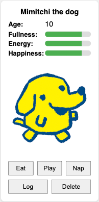
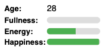
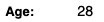
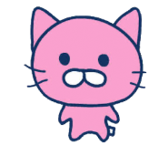
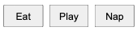

# Tamagotchi

## 3번째 시도는 관심사를 더 잘 분리하고 더 DRY하게 만드는 것입니다.

> index.js는 html만 처리하고, 타이머가 찾아서 tamagothi 구조로 
> 변환하는 익명 div를 만듭니다. 아이디어는 index.js에서 tamagotchi 
> 래퍼를 만들 수 있다는 것입니다. tamagotchi.js는 Tamagotchi 클래스를 
> 여기에 연결합니다.

> 클래스 Tamagotchi는 게임입니다. 게임을 HTML TamagotchiWrapper로 변환하는 클래스로 래핑됩니다.
> 
> 단순화하기 위해 모든 부분을 더 작은 클래스로 나누었습니다.
> 
> StatusPane, Log 및 Image는 생성자에서 tamagotchi.getStatus()를 가져오고 자체 타이머를 사용하여 스스로 업데이트할 수 있습니다.
> 
> LogPanel은 tamagotchi.getLog()와 동일한 작업을 수행합니다.# JS-2 OOP examen

## Objektorienterad programmering - Tamagotchi

## Projekt beskrivning

Det här projektet är ett virtuellt husdjurs-spel där användaren kan skapa upp till fyra olika Tamagotchis, som kan utföra olika aktiviteter. 

Spelet är byggt i JavaScript med objektorienterad programmering.

### Godkänt-krav:

- Användaren ska kunna skapa ett husdjur som kan utföra aktiviteter.
- Varje husdjur ska ha egenskaperna:
  - `name`, `animalType`, `energy`, `fullness`, `happiness`
- Djurtypen (`animalType`) ska kunna väljas mellan fyra förvalda typer.
- Alla värden (energy, fullness, happiness) ska vara mellan 0–100 och starta på 50.
- Aktiviteterna uppdaterar egenskaperna enligt:
  - **nap**: +40 energy, −10 happiness, −10 fullness
  - **play**: +30 happiness, −10 energy, −10 fullness
  - **eat**: +30 fullness, +5 happiness, −15 energy
- Ett meddelande ska visas vid varje aktivitet, t.ex. "You played with Maya!"
- En textruta ska visa en historik över alla aktiviteter.

###  Väl Godkänt-krav:

- Användaren ska kunna skapa flera husdjur (max 4 st).
- Om ett värde når 0 → husdjuret springer iväg (tas bort från DOM:en).
- Varje husdjur startar en timer vid skapande.
  - Var 10:e sekund minskar `energy`, `fullness` och `happiness` med 15.

## Arbetsprocessen

- Parallellt arbete: Grupprojekt (Hakim Livs) + Eget projekt (Tamagotchi)
-  Fokusväxling:
  - Prioritering beroende på tid och behov
  - Växlade mellan produktsida/inloggning och spelprojekt
-  Planering:
  - Först Godkänt, sen Väl Godkänt
  - Tänkte ut klassstruktur och logik innan kodning

  - SoC (Separation of concerns)

---

## Utmaningar

-  Tidsbalans:
  - Två projekt samtidigt
  - Bestämma vad som är mest akut
-  Multi-Tamagotchi:
  - Hur hanterar man flera instanser?
  - Begränsa till max 4 st
-  Misskötsel-logik:
  - När ska ett djur "springa iväg"?
  - Hur tar man bort det från DOM:en snyggt?

---

## Lärdomar

-  OOP-struktur:
  - Föräldraklass (Animal), statisk Game-klass
  - Instansbaserad logik
-  Tidsstyrd förändring:
  - `setInterval()` → nedräkning av värden var 10:e sekund
-  Begränsning och hantering:
  - Kontrollera max 4 djur
  - `runAway()` → rensar timer + tar bort från DOM
-  Lokala interaktioner:
  - `nap()`, `play()`, `eat()` – påverkar attribut och UI
-  Asynkron förståelse:
  - Hur `setTimeout`, `setInterval`, och `Promise` kan användas

## Deploy

link : (https://gdansklol.github.io/js-oop-examen/)
> 
> index.html은 매우 간단하며, 다마고치와 버튼, 메뉴에 대한 플레이스홀더만 포함되어 있습니다.
> 
> 게임은 관심사의 분리가 잘 되어 있고 DRY를 따릅니다.
> 
> AnimationPlayer는 약속에 사용되며, 모든 애니메이션은 시간이 걸리고, 이 타마고치는 차단해야 하지만 다른 타마고치는 차단하지 않아야 합니다.

StatusLabel은 나이를 표시하는 데 사용됩니다.

StatusBar는 에너지, 충만함, 행복을 표시하는 데 사용됩니다.

StatusPanel은 이제 모든 시각적 통계 유형을 반영합니다.

TamagotchiWrapper는 중앙 오케스트레이터입니다.

## TamagotchWrapper

### TitleRow

### StatusPanel

#### StatusLabel

#### StatusBar

### TamagotchiImage

### ButtonRow

