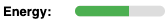

# Tamagotchi

## 3번째 시도는 관심사를 더 잘 분리하고 더 DRY하게 만드는 것입니다.

> index.js는 html만 처리하고, 타이머가 찾아서 tamagothi 구조로 
> 변환하는 익명 div를 만듭니다. 아이디어는 index.js에서 tamagotchi 
> 래퍼를 만들 수 있다는 것입니다. tamagotchi.js는 Tamagotchi 클래스를 
> 여기에 연결합니다.

> 클래스 Tamagotchi는 게임입니다. 게임을 HTML TamagotchiWrapper로 변환하는 클래스로 래핑됩니다.
> 
> 단순화하기 위해 모든 부분을 더 작은 클래스로 나누었습니다.
> 
> StatusPane, Log 및 Image는 생성자에서 tamagotchi.getStatus()를 가져오고 자체 타이머를 사용하여 스스로 업데이트할 수 있습니다.
> 
> LogPanel은 tamagotchi.getLog()와 동일한 작업을 수행합니다.
> 
> index.html은 매우 간단하며, 다마고치와 버튼, 메뉴에 대한 플레이스홀더만 포함되어 있습니다.
> 
> 게임은 관심사의 분리가 잘 되어 있고 DRY를 따릅니다.
> 
> AnimationPlayer는 약속에 사용되며, 모든 애니메이션은 시간이 걸리고, 이 타마고치는 차단해야 하지만 다른 타마고치는 차단하지 않아야 합니다.

StatusLabel은 나이를 표시하는 데 사용됩니다.

StatusBar는 에너지, 충만함, 행복을 표시하는 데 사용됩니다.

StatusPanel은 이제 모든 시각적 통계 유형을 반영합니다.

TamagotchiWrapper는 중앙 오케스트레이터입니다.

## TamagotchWrapper

### TitleRow

### StatusPanel

#### StatusLabel

#### StatusBar

### TamagotchiImage

### ButtonRow

